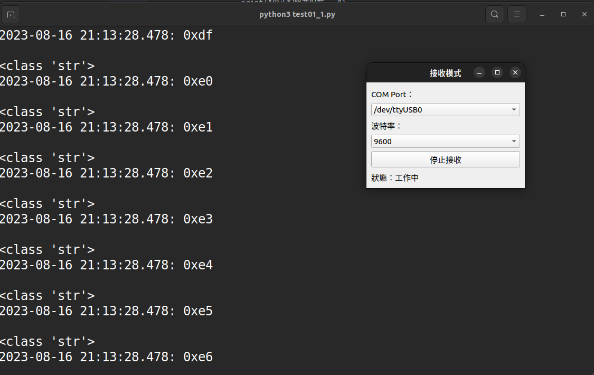
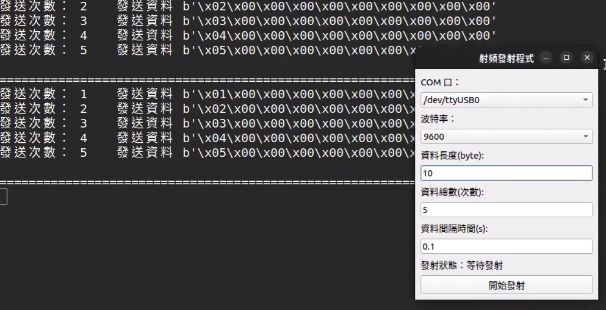

# 序列阜讀取

我打算用python,寫一個讀取序列阜的資訊並存取資料。
方便往後的資料分析，要作到這一點就要學會一些功能才會好用。

- time
- pyqt
- serial
- sys
- os
- datetime

## 傳輸的品質

- 距離
- 數度
- 漏包率

## 數據的結構

這個會影響到後面的解讀與計算

## 運行

目前只可以做到傳送與接收時候會有紀錄。\
但是記入的資料格式與之後要如何有效的解讀我還要在研究>\
目前是用pyserial來做序列阜的讀取與接收，界面是用pyqt5來做\

### 讀取

圖有點大，等我學會調整之後它應該就會正常了

### 寫入

我發現如果一次傳的資料長度過大，程式運行的速度就會明顯便慢\
主要應該是我寫程式的技術還不足，寫的複雜度過高\
這裡還要在研究一下

